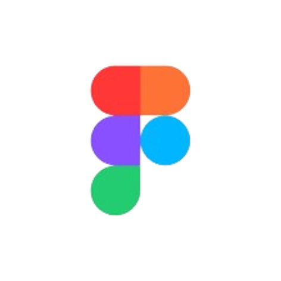

<!-- Header -->

<!--Summary | portfolio link-->

<!-- Heading | Connect linkedin gmail codolio--> 
<h2>Connect Supriya At:</h2>

---

<!--languages and tools-->

<!--badges streaks-->

  
  
  

 
<!-- Footer -->

